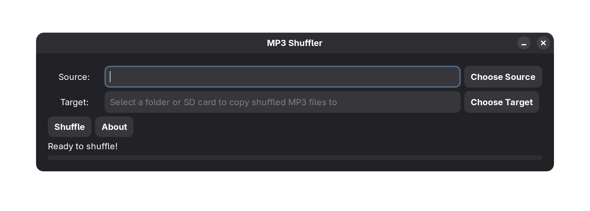

 
# MP3 Shuffler

Many bluetooth speakers that feature MP3 playback lack a shuffle function. MP3 Shuffler is a simple application that allows users to randomly shuffle and copy MP3 files from a source directory to a target device or directory. MP3 shuffler shuffles the files in addition to copying randomly as some players play by sorted file date instead of filename. You could also point MP3Shuffler at your music library and let it fill your music player or sdcard to capacity with random songs. The application features a user-friendly graphical interface built with the Gtk 3.0 framework.

## Features

- Select source and target directories.
- Randomly copy MP3 files from the source to the target directory.
- Progress bar to indicate the copying status.
- Error handling for file copying issues.

## Requirements

To run this application from source, you need to have Python 3.8 or better installed along with the following dependencies:

- Gtk libraries (included on Gnome desktops)
- PyGObject

To run this application from flaptpak, you only need flatpak installed. Flatpak will install all required runtimes.
## Installation

### Installing the pre-built flatpak

1. Ensure you have Flatpak installed on your system.
2. Download the mp3shuffler.flatpak file.
3. Open a terminal to the downloaded file.
4. Install with:
   ```
   flatpak install mp3shuffler.flatpak
   ```
5. Launch the application with:
   
   ```
   flatpak run io.github.jasonritchie06.mp3shuffler
   ```


### Building the Flatpak

1. Ensure you have Flatpak installed on your system.
2. Navigate to the `flatpak` directory in your terminal.
3. Build the Flatpak package using the following command:

   ```
   flatpak-builder --force-clean build-dir io.github.jasonritchie06.mp3shuffler.yaml
   ```

4. Install the application with:

   ```
   flatpak install build-dir
   ```

5. Run the application using:

   ```
   flatpak run io.github.jasonritchie06.mp3shuffler
   ```

### Running from Source

If you prefer to run the application directly from the source:

1. Clone the repository or download the source code.
2. Navigate to the `src` directory.
3. Install the required dependencies:

   ```
   pip install -r requirements.txt
   ```

4. Run the application:

   ```
   python shuffler_gtk.py
   ```

## Usage

1. Launch the application.
2. Select the source directory containing your MP3 files.
3. Select the target directory where you want to copy the shuffled files.
4. Click on the "Shuffle to Target" button to start the process.
5. The Shuffler app can also be used to fill up an sdcard or music player with random songs by
   pointing it at your music collection and shffuling random songs to the target device until it is full.


## License

This project is licensed under the MIT License - see the [LICENSE](LICENSE) file for details.
